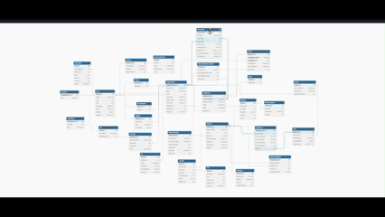

# Hospital Management System (HMS)

A comprehensive SQL-based Hospital Management System designed to handle clinical, administrative, and inventory data. This repository contains the core DDL commands for database creation, automation scripts, and relationship modeling.

---

## 🏥 The HMS ERD Diagram
The following diagram illustrates the complex relationships between Patients, Staff, Departments, and medical operations.

<p align="center">
  
</p>

---

## 🚀 Key Features
* **Patient Management**: Complete tracking of admissions, lab tests, and medical history.
* **Departmental Hierarchy**: Distinct logic for OT, Labs, CSSD, and Mortuary.
* **Staff & Scheduling**: Role-based access for Doctors, Nurses, and Technicians with shift scheduling.
* **Inventory & Logistics**: Real-time tracking of blood inventory, medical equipment, and inter-departmental transit.
* **Billing System**: Automated invoice generation based on room charges and medical tests.

---

## 🛠️ Database Schema Overview
The system is built on a relational architecture using **MySQL**. Key modules include:

| Module        | Description                           |
| :------------ | :------------------------------------ |
| **Core**      | Patients, Staff, Departments          |
| **Medical**   | Admissions, OT, Lab Tests, Blood Bank |
| **Inventory** | Equipments, Stock, Biomedical Repairs |
| **Clerical**  | Billing, Attendance, Reception        |

---

## 🖥️ Getting Started

### Prerequisites
* MySQL Server (v8.0+)
* VS Code with SQLTools Extension (Recommended)

### Installation
1. Clone the repository:
   ```bash
   git clone [https://github.com/Paul-Ephraim/HMS.git](https://github.com/Paul-Ephraim/HMS.git)

---
### 🗝️ Key Tools Used 
1. **Vscode** - [SQL TOOLS -Extension](https://marketplace.visualstudio.com/items?itemName=mtxr.sqltools)
2. **NotePad++**
3. **DB Diagram** - [dbdiagram.io](https://dbdiagram.io/home)
4. **Python** - [Script](gen.ipynb)

---
<p align ="center">
  <h1>THANK YOU</h1>
</p>

---